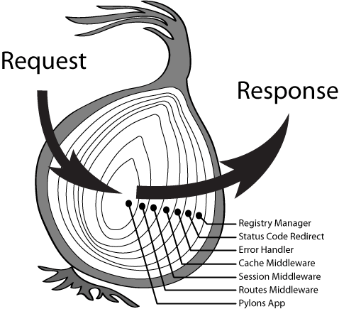

#### Mock Server入门介绍

##### 技术选择

- Express

- Koa

- Mock.js

- template engine(optional)

###### Express VS Koa

###### 相同点：

1. 师出同门

2. 底层用一套http基础库

###### 不同点：

Express：老牌，很多功能都是集成好的(route,视图处理),回调函数

Koa：更轻量，async/await

> 阿里的egg框架也是在koa上开发的

##### 

##### Koa搭建过程

安装依赖

> yarn add  koa, koa-router, koa-bodyparser

目录结构

Repo:

[https://github.com/houyaowei/koa-mock-server](https://github.com/houyaowei/koa-mock-server)

### End

